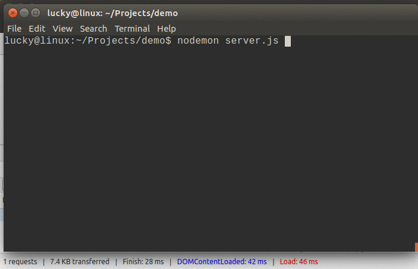

# open-in-editor-connect

Connect/Express extension to open a local file in an editor by URL. It could be useful addon for a local development server.

## Features

* Quickly open a local file in an editor from the browser. Just append line number to the URL.
* Easy to use with [open-in-editor-extension] for Google Chrome
* `X-SourcePath` HTTP header with a file path on a file system.
* Built-in adapter for the [serve-static] middleware.
* Configurable editors

## Installation

This is a Node.js module available through the npm registry. Installation is done using the npm install command:
```
$ npm install open-in-editor-connect
```

There are some examples the below how to use `open-in-editor-connect` middleware for a web server.

## Usage

Append line number to the URL in the location bar of a browser and a file will be opened in the editor.



### Examples

`curl -X POST -i "http://localhost:3000/server.js:123"`

Open the `/app/router.js` file in default editor and put a cursor to line 123:

`curl -X POST -i "http://localhost:3000/server.js:123?edit=sublime"`

Open the `/app/router.js` file in Sublime Editor and put a cursor to line 123:

## URLs

* `http://host/path:{line}`
* `http://host/path:{line}:{column}`

### Query Parameters

#### edit

* `http://host/path?edit`
* `http://host/path?edit={editor}`


## API

```
var openInEditor = require('open-in-editor-connect');
```
* `openInEditor(root, options)`
* `openInEditor(options)`

Create a new middleware function to handle files from within a given `root` directory.

If `root` is not provided then it returns new middleware factory where the given `options` will be set to defaults.

### root

The file to handle will be determined by combining `req.url` with the provided `root` directory.

### Options

#### dotfiles

Set how "dotfiles" are treated when encountered. Default is `ignore`.

* `allow` No special treatment for dotfiles.
* `ignore` Pretend like the dotfile does not exist and 404/next().
<!--* 'deny' Deny a request for a dotfile and 403/next().-->

#### editorParam

String name of query param. Default is `edit`.

#### serveStatic

Set this to `true` to return a wrapped version of for the `serve-static` middleware.
The main proporse of the wrapping is an ability to open in an editor the same files as they served.
Also the wrapper adds `X-SourcePath` HTTP header to the served files response.
Default is `false`.

The [serve-static] isn't a dependency of open-in-editor-connect.
The `dependencies` section of your application's package.json file must contain the `serve-static` module
in order to use the wrapper.

#### editor

Object with options for an editor.

**`name`**: An string name of an editor.

Supported names are:

| Name           | Editor                                      |
| -------------- | ------------------------------------------- |
| `atom`         | Atom Editor                                 |
| `emacs`        | Emacs (via Terminal, Mac OS and Linux only) |
| `idea14ce`     | IDEA 14 CE                                  |
| `phpstorm`     | PhpStorm                                    |
| `sublime`      | Sublime Text                                |
| `vim`          | Vim (via Terminal, Mac OS and Linux only)   |
| `visualstudio` | Visual Studio                               |
| `webstorm`     | WebStorm                                    |


Use these setting if the editor currently is not supported or if the editor's path can't be detected automatically.

**`binary`**: A string path to the editor binary

**`args`**: A string of command line arguments which will be passed to the `binary`. The `args` can contain placeholders to be replaced by actual values. Supported placeholders: `{filename}`, `{line}` and `{column}`

**`terminal`**: Set this to `true` if the editor should be opened in a terminal. Mac OS and Linux are supported.

## Examples

### Connect: Open in Visual Studio Code
```
var connect = require('connect');
var serveStatic = require('serve-static');
var openInEditor = require('open-in-editor-connect', {
  editor: { name: 'code' }
});

var app = connect();
app.use(openInEditor('.'));
app.use(serveStatic('.'));
app.listen(3000);
```

### Connect: Wrap the serve-static to handle the same path
```
var connect = require('connect');
//var serveStatic = require('serve-static');
var serveStatic = require('open-in-editor-connect', {
  editor: { name: 'code' },
  serveStatic: true
});

var app = connect();
app.use(serveStatic('.', { index: ['index.html'] }));
app.listen(3000);
```

### Customize options per directory

```
var openInEditor = require('open-in-editor-connect);

app.use(openInEditor('/', { editor: { name: 'code' } }));
```

## License

[MIT](LICENSE)

## For more information

-   Easy to use with [open-in-editor-extension] for Google Chrome
-   Powered by [open-in-editor]

**Enjoy!**

[serve-static]: https://www.npmjs.com/package/serve-static
[open-in-editor]: https://github.com/lahmatiy/open-in-editor
[open-in-editor-extension]: https://chrome.google.com/webstore/detail/open-in-editor/fmgbklepjbpnmgplnabblaehammnbmgg
